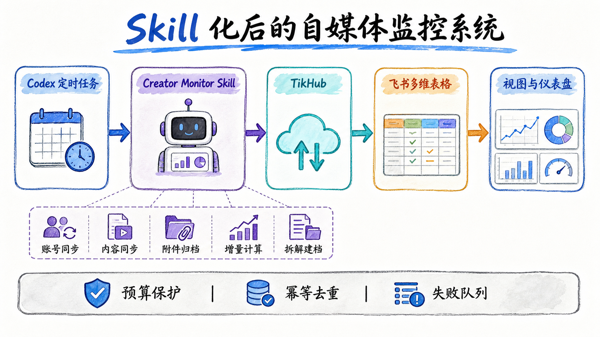

# TikHub × 飞书自媒体竞品情报 Skill

一个面向 Codex 的开源 Skill：定时追踪抖音、小红书公开账号，把账号、作品、真实封面、评论和互动趋势更新到飞书多维表格，并形成可直接使用的榜单、画册、选题看板和仪表盘。



## 用户看到什么

- `账号库`：头像、账号定位、地区、粉丝规模、作品数和近期互动。
- `内容库`：原作品封面、标题、互动数据、内容方向、榜单排名和推荐理由。
- `待处理 / 已采用`：日常只保留两个业务状态。
- `本周榜单`：Top 1 至 Top 10 与仪表盘使用同一份数据。
- `封面灵感`：画册直接展示竞品作品自己的真实封面。
- `情报总览`：账号、内容、Top 3、平台、方向、地区、趋势和评论需求。

系统维护信息和历史快照不会出现在默认业务视图中。

## 快速开始

要求：Python 3.11+、[uv](https://docs.astral.sh/uv/)、`lark-cli`、TikHub API Key，以及已授权的飞书用户身份。

```bash
git clone https://github.com/Stephen-creater/tikhub-feishu-creator-monitor-skill.git
cd tikhub-feishu-creator-monitor-skill
uv sync --extra dev
cp examples/accounts.example.json runtime/accounts.json
```

密钥放入环境变量或系统密钥存储，不要写进仓库。然后执行：

```bash
scripts/creator-monitor doctor
scripts/creator-monitor bootstrap
scripts/creator-monitor scheduled-sync
```

## 真实封面

封面来自 TikHub 返回的公开作品数据。Skill 下载原作品封面并上传为飞书附件，避免临时 CDN 链接过期。AI 生图只用于教程示意图，不用于替代竞品作品封面。

## 榜单口径

```text
内容热度 = 点赞数 + 3 × 收藏数 + 2 × 评论数 + 4 × 分享数
```

同一套口径同时用于本周榜单和仪表盘 Top 1、Top 2、Top 3。

## 数据边界

- 只处理平台公开数据。
- 评论按需采样，不穷举抓取。
- 真实作品与演示历史必须明确区分。
- 每轮运行同时受请求数和美元预算保护。
- 密钥、运行缓存和本地配置均被 Git 忽略。

详见 [数据口径](references/data-contract.md) 和 [运行说明](references/operations.md)。
