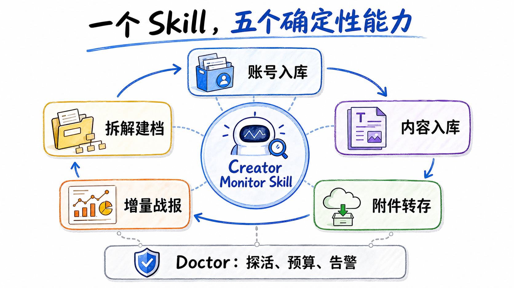
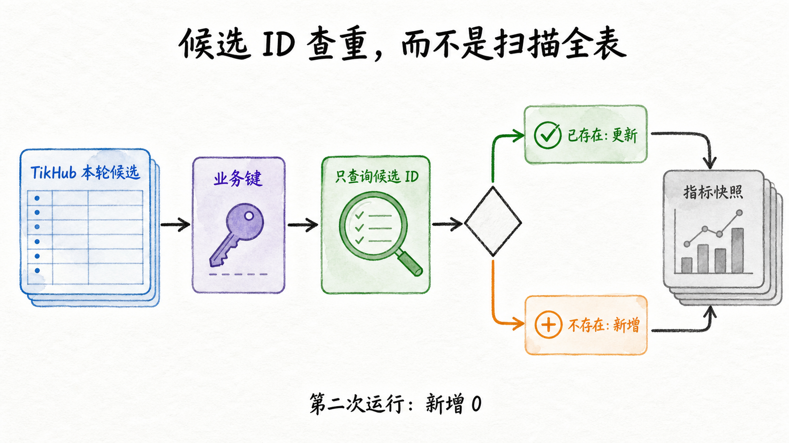
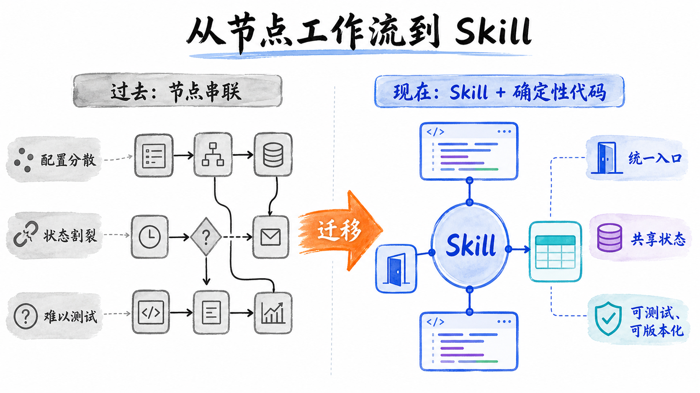

# TikHub × Feishu Creator Monitor Skill

一个面向 Codex 的开源 Skill：通过 TikHub 追踪抖音和小红书对标账号，将账号、作品、评论与指标快照幂等同步到飞书多维表格，并生成爆款战报、拆解文档和仪表盘。


项目已经完成可验证 MVP：真实 TikHub 双平台数据、飞书 Base、六个视图、十二个仪表盘组件、评论采样、附件转存、飞书妙记 ASR、拆解文档、互动战报卡片和 Codex 定时任务均已跑通。当前范围仍是小额预算和公开账号，不承诺生产级吞吐或平台 SLA。

## 设计原则

- 一个总控 Skill，内部拆分账号同步、内容同步、附件转存、增量战报和拆解建档。
- Skill 负责理解和调度，版本化 Python 代码负责确定性抓取、去重、计算和重试。
- 飞书 Base 是协作与数据产品层，不承担爬虫分页和幂等控制。
- 所有密钥仅保存在本机环境，不进入仓库、日志、fixture 或飞书文档。

## 当前状态

截至 2026-08-30：

- 42 项自动化测试通过。
- 抖音与小红书当前接口适配器已验证。
- 业务键幂等在真实 Base 上通过二次运行验证。
- TikHub 保守预算账本为 0.13 美元。
- Codex 定时任务已真实触发一次零请求缓存运行，验收后暂停。

详见 [验收报告](docs/acceptance-report.md) 与 [实施计划](docs/plans/2026-08-30-creator-monitor-skill.md)。

## 快速开始

要求：Python 3.11+、[uv](https://docs.astral.sh/uv/)、[lark-cli](https://github.com/larksuite/cli)、TikHub API Key，以及已授权的飞书用户身份。

```bash
git clone https://github.com/Stephen-creater/tikhub-feishu-creator-monitor-skill.git
cd tikhub-feishu-creator-monitor-skill
uv sync --extra dev
```

复制并填写账号配置：

```bash
mkdir -p runtime
cp examples/accounts.example.json runtime/accounts.json
```

密钥优先放入环境变量或系统密钥存储，不要写进仓库。随后执行：

```bash
scripts/creator-monitor doctor
scripts/creator-monitor bootstrap --dry-run
scripts/creator-monitor bootstrap
scripts/creator-monitor scheduled-sync
```

第二次运行必须出现 `inserted: 0`，否则不要继续配置定时任务。

## 一个 Skill，五项内部能力



- 账号入库：解析与刷新账号画像。
- 内容入库：抓取最新内容并按候选业务键新增或更新。
- 附件转存：把会过期的封面与媒体保存成飞书附件。
- 增量战报：写入时间桶快照，计算增量并发送 Card 2.0 战报。
- 拆解建档：评论采样、飞书妙记 ASR、内容分析、文档创建与回填。

公开 CLI 以 `scheduled-sync` 作为完整闭环入口，避免让多个外部命令重复管理游标、预算和运行状态。

## 去重语义



系统采用“至少一次抓取 + 业务键幂等”，不声称数据库级 exactly-once：

- 账号键：`platform:account_id`
- 内容键：`platform:content_id`
- 评论键：`platform:comment_id`
- 快照键：`platform:content_id:time_bucket`

每轮只查询 TikHub 本轮候选 ID，不扫描整张历史表。Base 返回采用列式协议时会恢复为记录对象；新写入后会有界重读，吸收飞书最终一致性延迟。

## 文档

- [数据契约](references/data-contract.md)
- [运行手册](references/operations.md)
- [TikHub 端点选择](references/tikhub-endpoints.md)
- [真实截图清单](docs/screenshot-checklist.md)
- [验收报告](docs/acceptance-report.md)



## License

MIT
